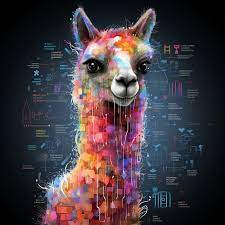

# Ollama example

## Ollama launch
1. Run ollama: `make up`
2. Run model: `make run-ollama3`
3. Use the console or [ollama web interface](http://localhost:8080) to chat.

For more commands check [Makefile](Makefile).

## Simple RAG (Retrieval Augmented Generation) app launch
1. For launching RAG Python project open [project](app_rag) in IDE (for VS Code use the command `make rag-prj`).
2. Follow the description in [README.md](app_rag/README.md).